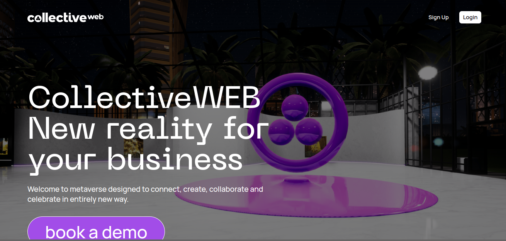
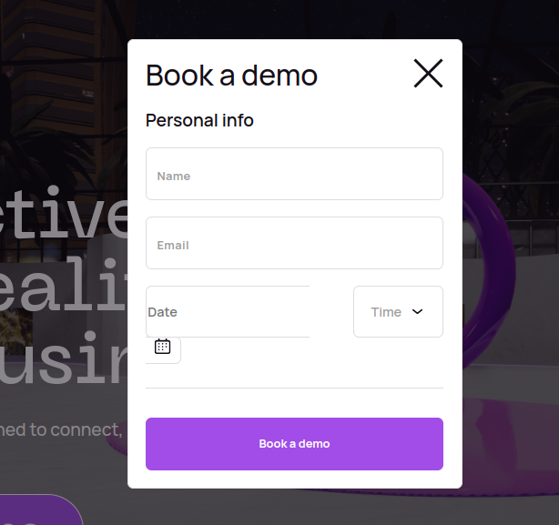

# CollectiveWEB Project

## Overview

CollectiveWEB is a revolutionary web application that brings a new dimension to business interactions through the concept of a metaverse. It aims to connect, create, collaborate, and celebrate in ways that go beyond traditional online platforms. The project focuses on providing users with a unique and immersive experience, combining elements of virtual reality, communication, and collaboration.

## Key Features

- **Hero Section:** Introduces users to the concept of CollectiveWEB, showcasing its purpose and inviting them to explore further.

- **Book a Demo Form:** A user-friendly form allowing individuals to schedule a demo and experience the metaverse firsthand.

- **Case Studies:** Presents a detailed case study of the WOW Summit in the metaverse, demonstrating the application's capabilities in hosting virtual exhibitions.

- **Offered Services:**

  - **Virtual Twin:** Provides a global, accessible experience for brands through their virtual twin.
  - **Web3 Presence:** Allows brands to join the Web3 era via the virtual space, powered by CollectiveWEB.
  - **New Form of Communication:** Introduces a novel communication format to attract new customers and increase engagement.

- **Reviews Section:** Showcases feedback from users and partners who have experienced the metaverse, highlighting its impact and success stories.

- **Footer:** Contains essential contact information, social media links, and navigation to different sections of the application.

## Tech Stack

- **Frontend:**

  - HTML5
  - CSS3
  - JavaScript (including the Swiper library for dynamic slides)

- **Backend:**

  - No explicit backend mentioned in the provided code snippet.

- **Additional Libraries:**

  - Swiper (v8): Used for implementing a card-based review section.

- **Frameworks:**
  - Bootstrap: Utilized for responsive and visually appealing design components.
- **Technologies:**

  - Web3 Technologies (implied): Leveraged for creating a metaverse experience.

- **Dependencies:**
  - Bootstrap (CSS and JavaScript)
  - Swiper Library

## License

The project's code is not explicitly provided with a license. For licensing details, please reach out to the CollectiveWEB team.
